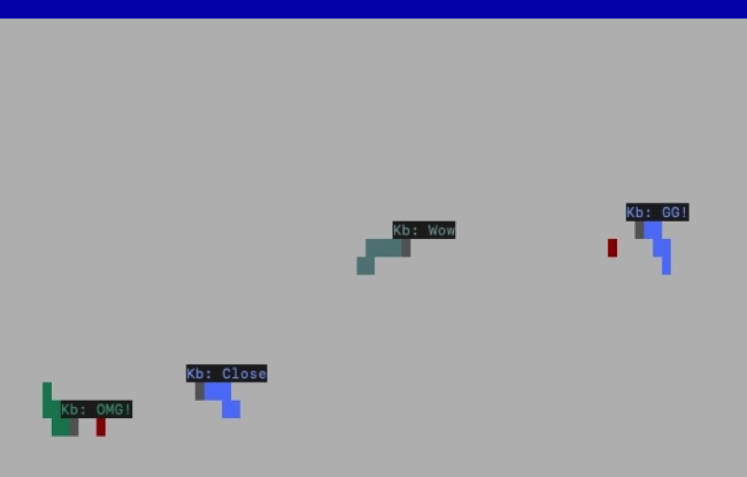

# Snake Client Project

Snake game is a very popular video game. It is a video game concept where the player maneuvers a dot and grows it by ‘eating’ pieces of food. As it moves and eats, it grows and the growing snake becomes an obstacle to smooth maneuvers. The goal is to grow it to become as big as possible without bumping into the side walls, or bumping into itself, upon which it dies.

This is simply a multiplayer take on the genre.

Before you can run this client, you will need to be running the server side which you can download and install from here. 

## Final Product



## Installation Server
- Follow the installation steps inside the [snek server](#https://github.com/lighthouse-labs/snek-multiplayer) repo to run the server side.

## Installation Client
### Clone the repository

```bash
git clone https://github.com/Karamvir-Bains/snake-client.git
cd snake-client
```
- Run the development snake client using the `node play.js` command.

## How To Play
- Use your `WASD` keys to change your snakes direction.
- Use can send quick messages by pressing keys `1, 2, 3, 4`.
- Gain points by eating the red dots.
- Colliding into walls, players, or yourself, results in a game over.

### Controls
| Default Keybinds | Command  |
|-----|-----------------------|
| "w" | Move Up               |
| "a" | Move Left             |
| "s" | Move Down             |
| "d" | Move Right            |
| "1" | Send Message "Wow"    |
| "2" | Send Message "OMG!"   |
| "3" | Send Message "Close"  |
| "4" | Send Message "GG!"    |

## Change Username
- Inside `constants.js` modify `PLAYER_NAME` to a maximum of 3 characters.

## Change Controls
- Inside `constants.js` modify the `USER_CONTROLS` object to change keybinds and messages.

## Change Server Connection
- Inside `constants.js` modify the `IP` and `PORT` to connect to another server outside of localhost.